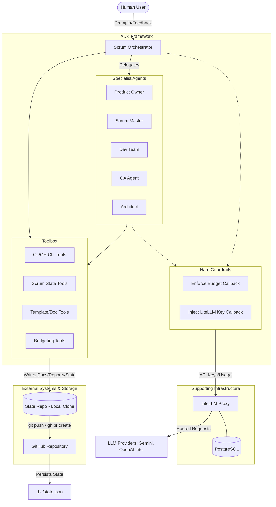

# Horseless-Carriage

A multi-agent Scrum team at your disposal—implemented as a small set of role-focused agents (PO, SM, Dev, QA, Architect) orchestrated by a root “ScrumOrchestrator”.

## What’s in this repo

- `agents/scrum_team/`
  - `agent.py` — defines the root orchestrator plus sub-agents (Product Owner, Scrum Master, Dev Team, QA, Architect) and wires them to models via LiteLLM.
  - `prompts.py` — role prompts and routing rules for the orchestrator.
  - `tools/` — a package of lightweight “Scrum artifact” tools (backlog, github, budget, docs, etc.).
  - `__init__.py` — exports `root_agent`.

- `litellm.yaml` — model aliases used by the agents (e.g., `scrum-po`, `scrum-dev`, etc.).
- `docker-compose.yaml` — runs a local LiteLLM proxy on port `4000` using `litellm.yaml`.
- `.env.example` — environment variables for provider keys + LiteLLM proxy configuration.
- `requirements.txt` — Python dependencies.
- `setup.sh` — setup script for the project.
- `run.sh` — run script for the agent.
- `run_tests.sh` — script to run tests.
- `doctor.sh` — a script to validate your setup.
- `check_state_repo.sh` — a script to validate the state repository.
- `PREFLIGHT.md` — a pre-flight checklist to ensure your environment is correctly set up.
- `MANUAL.md` — a user manual: concepts, day-to-day usage, and common workflows.
- `RELEASE.md` — how this repo itself is versioned and released (SemVer + GitFlow), and how the team-performance evaluation harness works.
- `SECURITY.md` — secret-handling notes and how to report a vulnerability.
- `VERSION` — the current Horseless Carriage version.
- `eval/scenario/PRODUCT-VISION.md` — the fixed product vision used to automatically evaluate the agent team's own performance each release; see [RELEASE.md "Team performance evaluation"](RELEASE.md#team-performance-evaluation).

## How it works (high level)

- A **root agent** (ScrumOrchestrator) receives your request and delegates to specialist sub-agents based on intent:
  - **Product Owner**: vision/goals, backlog items, acceptance criteria, prioritization
  - **Scrum Master**: facilitation, impediments, retros/actions
  - **Dev Team**: estimates, implementation plan, risks, test approach
  - **QA**: test strategy and quality signals
  - **Architect**: architectural risks and tradeoffs

- Agents maintain a shared in-session “source of truth” of Scrum artifacts (vision, goals, backlog, sprint goal, sprint backlog, DoD, impediments, retro actions, decision log).

## Setup

Run the setup script:

```bash
./setup.sh
```

This will:
1. Check for Docker and Docker Compose.
2. Guide you through GitHub CLI setup.
3. Create a `.env` file from the template (if it doesn't exist).
4. Start the database and LiteLLM containers.

After running setup, please edit the `.env` file to add your specific API keys and configuration.

Before running the agent, it is recommended to run the doctor script to validate your setup:

```bash
./doctor.sh
```

For a more detailed guide, see the [PREFLIGHT.md](PREFLIGHT.md) checklist.

## Running the Agent

Run the agent using the `run.sh` script:

```bash
./run.sh
```

This script will:
1. Load environment variables from `.env`.
2. Check for the existence of the state repository path.
3. Build and run the agent container.
4. Wait for the LiteLLM dashboard (and, in web mode, the ADK web UI) to come up, then open them in your default browser.

`run.sh` supports three modes, which can be combined:

| Command | Behavior |
|---|---|
| `./run.sh` | **Default.** ADK web frontend, foreground, at `http://localhost:8000`. |
| `./run.sh cli [query...]` | Interactive CLI session in your terminal instead of the web UI. |
| `./run.sh daemon` | Add to either of the above to run detached (`./run.sh daemon` or `./run.sh cli daemon`). |

The LiteLLM admin dashboard (`http://localhost:4000/ui`) is opened automatically in every mode.

### Running in Daemon Mode

To run the agent in the background:

```bash
./run.sh daemon
```

To view logs when running in daemon mode:

```bash
docker compose logs -f agent
```

## Logging & Session Management

### Logging
The system uses Docker Compose for logging, which captures both orchestrator activity and sub-agent delegations.
- **View Real-time Logs**: `docker compose logs -f agent`
- **Verbosity**: The agent runs in `--verbose` mode by default, providing detailed traces of tool calls, LLM interactions, and state transitions.

### Session Management
Sessions are managed by the ADK framework to ensure continuity across restarts:
- **Persistence**: Conversation history and agent state are stored in the `sessions/` directory as `.session.json` files.
- **Session Identification**: Each run uses a `SESSION_ID` (defined in `.env`).
- **Resuming**: The `run.sh` script automatically detects existing session files and uses the `--resume` flag to pick up where the team left off.
- **Interruption**: You can stop the agent at any time (e.g., by pressing `Ctrl+C` in interactive mode). The framework will automatically save the session state to a file on exit.
- **Metadata**: A shared SQLite database (`sessions/adk_sessions.db`) tracks session lifecycle and metadata, ensuring that even if the container is removed, the session history remains accessible.

## Testing

### Unit and Integration Tests

To run the complete test suite (both unit and integration tests) using Docker Compose:

```bash
./run_tests.sh
```

This script executes `pytest` inside the agent container, providing full network access to the LiteLLM and Database services. It includes coverage reporting for the `agents/` package.

### Integration Testing

The integration test suite (`test_llm_integration.py`) verifies the end-to-end connection between the agents and the LiteLLM Proxy. It ensures that:
- **Key Generation**: Virtual keys are correctly created for different agent roles.
- **Budget Association**: These keys are correctly linked to the shared `scrum-sprint-budget`.
- **Proxy Routing**: LLM calls from agents are successfully routed through the LiteLLM Proxy.

For integration tests to function, the `./run_tests.sh` script utilizes `docker compose run`, which automatically starts the necessary dependency containers (`litellm` and `db`) if they are not already active.

## State Repository

The **State Repository** is the team's "Source of Truth." It is a dedicated directory (ideally a Git repository) where the agents persist all project-related data.

### Concept
Unlike the session history (which is transient and internal), the State Repository contains human-readable artifacts and the official project state. This separation allows the agents to be ephemeral while the project remains permanent.

### Structure
- **`state.json`**: The internal machine-readable state of the Scrum artifacts (backlog, impediments, etc.).
- **`specs/`**: A directory containing the actual generated documents (PRDs, ADRs, Stories) based on the templates in `spec-templates/`.

### Usage
- **Configuration**: Set the `STATE_REPO_PATH` in your `.env` file to point to your target repository.
- **Persistence**: Tools used by the agents automatically commit changes to this repository (if configured) or write them directly to the filesystem.

## Diagnostics & Maintenance

### Doctor Script

The `doctor.sh` script validates your local environment, ensuring Docker is running, the `.env` file is correctly configured, and the state repository path is accessible.

```bash
./doctor.sh
```

### State Repository Check

The `check_state_repo.sh` script verifies that your state repository is in the expected state for the tools to work correctly. It checks for the correct directory structure and ensures no stray template files are present in the `specs` directory.

```bash
./check_state_repo.sh
```

## Using the Scrum team agent

This repository provides the agent implementation under `agents/scrum_team/`. The package exports:

- `agents.scrum_team.root_agent`

Exactly how you *run* the agent depends on the host app / runner you plug it into (for example, an ADK-based runner). The key point is that `root_agent` is the entrypoint and it orchestrates the rest.

## Notes

- If `LITELLM_PROXY_API_BASE` is set, the agents assume “proxy mode” and use LiteLLM via the proxy endpoint.
- Keep your `.env` local and never commit real API keys.

## Architecture

The following diagram describes the interaction between the user, the ADK framework, the Scrum agents, and the supporting infrastructure (LiteLLM & GitHub).



## Budget Management

The system implements a **dual-layer budgeting strategy** to ensure both operational safety and financial control. This approach leverages LiteLLM's native financial enforcement while providing local, high-fidelity control over the logical "Sprint Budget" in tokens.

### 1. Token Budget (ADK Layer)
- **Unit**: Total tokens (e.g., 1,000,000).
- **Enforcement**: Hard-blocked locally, purely from session state/`SPRINT_TOKEN_BUDGET` — no
  call to LiteLLM is involved, so this guardrail applies **even if the LiteLLM proxy isn't
  running**. See step 1 of `check_cost_budget_callback` in `agents/scrum_team/agent.py`
  (usage is recorded by the separate `update_token_usage_callback`).
- **Automatic Tracking**: The system automatically tracks token usage after every LLM call and attributes it to the specific agent role.
- **Purpose**: Prevents long-running loops or runaway agent conversations. LiteLLM natively supports rate limits (tokens per minute) but does not provide a hard-stop for a *total cumulative token quota* across an entire sprint. Local enforcement provides immediate, zero-latency feedback and allows for a pure "logical" work limit.

### 2. USD Budget (LiteLLM Layer)
- **Unit**: US Dollars (e.g., $0.50).
- **Enforcement**: Hard-blocked by the LiteLLM Proxy, plus a real-time pre-call check
  against current spend on the shared `scrum-sprint-budget` object.
- **Purpose**: Provides financial guardrails and visibility in the LiteLLM Admin UI via
  the `scrum-sprint-budget` object. LiteLLM is the authority on costs and
  provider-level pricing. By setting a `max_budget` on the `scrum-sprint-budget`
  object, we ensure that the team never exceeds a hard financial limit, regardless of
  the token count.
- **Requires the LiteLLM proxy to actually be running.** Step 2 of
  `check_cost_budget_callback` only runs this check `if master_key and proxy_base` (both
  `LITELLM_MASTER_KEY` and `LITELLM_PROXY_API_BASE` set) — if either is unset, the USD
  check is **skipped outright** (not failed closed), and only the token budget above still
  applies. If the proxy *is* configured but unreachable (e.g. the container isn't up), the
  check does fail closed with a `[BUDGET ERROR]` instead. In short: no USD guardrail at all
  without proxy config; a hard stop instead of silent bypass if it's configured but down.
  `agents/scrum_team/scripts/run_eval.py` checks proxy reachability itself before a local
  (non-CI) run and refuses to proceed without an explicit `--dev-mode` flag — see
  RELEASE.md "Team performance evaluation".
- **No unscoped fallback spend**: every specialist agent's calls are blocked in code
  until it has its own `scrum-sprint-budget`-attached virtual key —
  `create_litellm_virtual_key()` must run for it first. Without this, a missing key
  would silently fall back to `LITELLM_PROXY_API_KEY`, which isn't attached to
  `scrum-sprint-budget` and so wouldn't be covered by the check above at all (this
  matters in particular right after a [LiteLLM database wipe recovery](#recovering-from-a-litellm-database-wipe),
  where that fallback key is briefly pointed at the unbounded master key). The
  Orchestrator itself is exempt from this specific check, since it needs one
  bootstrap call to create everyone else's key in the first place — see
  `check_cost_budget_callback` in `agents/scrum_team/agent.py`.
- **Tools**: `update_budgets(total_usd=0.50)`, `create_litellm_virtual_key()`.

### Monitoring & Reporting

#### Quality KPIs
The system tracks performance indicators to provide visibility into team health:
- **Say-Do Ratio**: Compares planned vs. completed stories. A ratio of 1.0 means the team delivered exactly what was promised.
- **Commitment Reliability**: Measures the accuracy of the team's estimates and delivery capability.
- **Defect Escape Rate**: Percentage of defects found after a story is marked as "Done".
- **Code Complexity**: A maintainability metric to ensure long-term velocity.
- **Test Coverage**: The percentage of the codebase exercised by automated tests.
- **Vulnerability Scan Results**: Tracks critical, high, medium, and low security findings.

#### Sprint Report
At the end of each sprint, the Product Owner generates a `SPRINT-REPORT-LATEST.md` which includes a detailed breakdown of token usage per agent, total USD spend, and quality metrics.

Example report content:
```markdown
# Sprint Review Report

## Summary
Completed the core implementation of the GitHub integration and established the CI pipeline.

## Accomplishments
- Implemented `gh_pr_comment` and `gh_pr_review` tools.
- Set up Docker-based test runner.
- Integrated Quality KPI calculations into the workflow.

## Budget and Usage
- USD Budget (LiteLLM): $0.50
- Process Overhead: 15%

### Per-Agent Token Usage
  - ProductOwner: 45,200
  - DevTeam: 120,500
  - ScrumMaster: 12,300

## Quality Dashboard
- Say-Do Ratio: 0.9
- Test Coverage: 85%
- Defect Escape Rate: 2%
```

#### Admin UI
Log in to `http://localhost:4000/ui/` to see real-time cost tracking and budget status for the `scrum-sprint-budget`.

## Agent Identity
Whether using a personal account or a dedicated GitHub App, the system automatically distinguishes between agent roles to ensure clear ownership and traceability.

### Role Attribution
1. **Git Commits**: Every commit is attributed to the specific agent role (e.g., `Architect` or `DevTeam`) via `GIT_AUTHOR` and `GIT_COMMITTER` settings.
2. **PR Comments and Reviews**: Tools like `gh_pr_comment` and `gh_pr_review` automatically prefix messages with the agent's role (e.g., `**Architect:** ...`), ensuring clear visibility in PR discussions.
3. **LiteLLM Spend**: Each agent uses its own virtual key, allowing you to track spend per role in the LiteLLM Admin UI.

### Recovering from a LiteLLM Database Wipe

If you clear the LiteLLM database (e.g., via `docker compose down -v`), your old virtual keys will become invalid. 

1. **Temporary Auth**: Update `LITELLM_PROXY_API_KEY` in your `.env` to match your `LITELLM_MASTER_KEY`. This allows the Orchestrator to start.
2. **Run Orchestrator**: Run the `ScrumOrchestrator`. It will detect the missing keys and re-initialize the agents, creating new virtual keys in the fresh database.
3. **Update .env**: After initialization, you can generate a new general-purpose virtual key via the Admin UI or by copying one of the agent keys and update your `.env` for better tracking.

---

## GitHub Integration

The agents can interact with GitHub using either a **Personal Account** (via the `gh` CLI) or a **GitHub App** (for a dedicated "Agent" identity).

### Option 1: Personal Account
This is the simplest setup. Ensure the `gh` CLI is installed and authenticated on your host machine:
```bash
gh auth login
```

### Option 2: GitHub App (Recommended for Agents)
To have the agents act as a distinct entity in your **Workspace Repo** (e.g., Kronograf), follow this simplified setup:

1.  **Create**: Go to **Settings** → **Developer settings** → **GitHub Apps** → **New GitHub App**.
    *   **Name**: `Horseless-Carriage-Agent`
    *   **Webhook**: Uncheck "Active".
2.  **Permissions**: Under **Permissions & events** → **Repository permissions**:
    *   `Contents` & `Pull requests`: **Read & write**.
    *   `Metadata`: **Read-only**.
3.  **Install**: Go to **Install App** in the sidebar and install it **ONLY** on your **Target Workspace Repository**.
4.  **Credentials**: 
    *   Copy the **App ID** from the General page.
    *   Copy the **Installation ID** from the URL after installing (e.g., `.../installations/12345678`).
    *   Click **Generate a private key**, and keep the `.pem` file content ready.
5.  **Configure**: Provide these 3 items to the `ScrumOrchestrator` Setup Wizard. It will handle the rest!

## Repository documentation structure

This project separates documentation templates from the actual specification artifacts:

### 1. Specification Templates (`spec-templates/`)
Stored in this repository, these provide the structure for Scrum artifacts.

- `spec-templates/requirements/` — Product Requirements Document (PRD) and Software Requirements Specification (SRS) templates.
- `spec-templates/architecture/` — Architecture Decision Record (ADR) templates.
- `spec-templates/stories/` — User story templates.
- `spec-templates/workflows/` — Agentic workflow and runbook templates.

### 2. Specification Artifacts (`specs/`)
Stored in your **target state repository** (configured via `STATE_REPO_PATH`), these are the actual documents generated and updated by the agents.

- `specs/requirements/` — Active PRDs and SRS documents.
- `specs/architecture/` — Architecture Decision Records (ADRs).
- `specs/stories/` — Refined User Stories.
- `specs/workflows/` — Agentic workflows and runbooks.
- `specs/reports/` — Sprint review reports and budget status.
- `specs/ROADMAP.md` — Product roadmap tracking releases and stories.

Contribution rules
- One artifact per file; keep them small and link related docs together
- Update docs in the same PR as the related code when possible
- Never commit real secrets — use placeholders, keep real values in your local `.env`

## This repo's own GitHub scaffolding

Separate from the GitHub *integration* above (how the agents authenticate against
your target repo), this repo also ships static scaffolding for maintaining
Horseless Carriage's own GitHub presence. These files are **not read by the agent
runtime** — they're plain repo hygiene you can adopt/edit like any other OSS
project:

- `.github/workflows/ci.yml` — runs the test suite on every push/PR.
- `.github/workflows/release.yml` — publishes a GitHub Release on `v*.*.*` tag push; see [RELEASE.md](RELEASE.md).
- `.github/ISSUE_TEMPLATE/` — bug report and feature request templates.
- `.github/PULL_REQUEST_TEMPLATE.md` — PR checklist emphasizing documentation updates.
- `.github/CODEOWNERS` — edit to your team.
- `config/github_config.yaml` — declarative notes on intended repo policy (branch protection, etc.) for humans setting up the GitHub repo's settings by hand; nothing in the codebase applies it automatically.

For how the *agents themselves* authenticate to GitHub, see
[GitHub Integration](#github-integration) above — that's the real, live
configuration (`GITHUB_TOKEN` or `GITHUB_APP_*` in `.env`).

## Security

See [SECURITY.md](SECURITY.md) for secret-handling notes and how to report a
vulnerability.