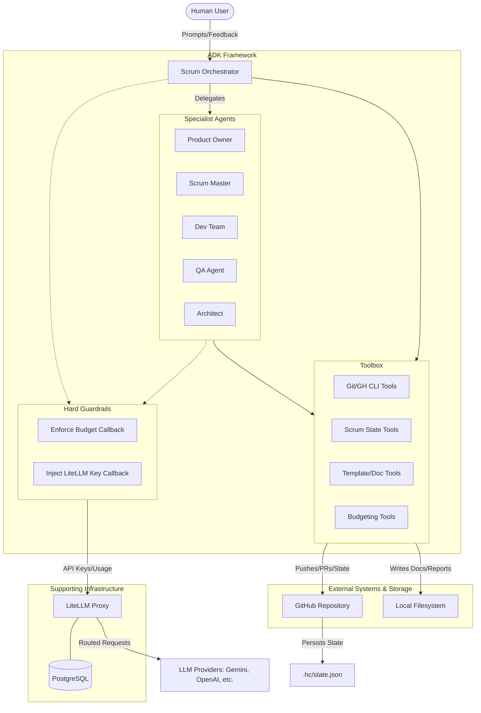

# Horseless-Carriage

A multi-agent Scrum team at your disposal—implemented as a small set of role-focused agents (PO, SM, Dev, QA, Architect) orchestrated by a root “ScrumOrchestrator”.

## What’s in this repo

- `agents/scrum_team/`
  - `agent.py` — defines the root orchestrator plus sub-agents (Product Owner, Scrum Master, Dev Team, QA, Architect) and wires them to models via LiteLLM.
  - `prompts.py` — role prompts and routing rules for the orchestrator.
  - `tools.py` — lightweight “Scrum artifact” tools that read/write shared state (backlog, sprint backlog, impediments, retro actions, decision log, etc.).
  - `__init__.py` — exports `root_agent`.

- `litellm.yaml` — model aliases used by the agents (e.g., `scrum-po`, `scrum-dev`, etc.).
- `docker-compose.yaml` — runs a local LiteLLM proxy on port `4000` using `litellm.yaml`.
- `.env.example` — environment variables for provider keys + LiteLLM proxy configuration.
- `requirements.txt` — Python dependencies.

## How it works (high level)

- A **root agent** (ScrumOrchestrator) receives your request and delegates to specialist sub-agents based on intent:
  - **Product Owner**: vision/goals, backlog items, acceptance criteria, prioritization
  - **Scrum Master**: facilitation, impediments, retros/actions
  - **Dev Team**: estimates, implementation plan, risks, test approach
  - **QA**: test strategy and quality signals
  - **Architect**: architectural risks and tradeoffs

- Agents maintain a shared in-session “source of truth” of Scrum artifacts (vision, goals, backlog, sprint goal, sprint backlog, DoD, impediments, retro actions, decision log).

## Setup

### 1) Create and activate a virtualenv

bash python -m venv .venv source .venv/bin/activate

### 2) Install dependencies

bash pip install -r requirements.txt

### 3) Configure environment variables

Copy `.env.example` to `.env` and fill in at least one provider key that matches the models you intend to use.

#### Personal Account (Default)
To use your personal GitHub account for agent actions, simply run `gh auth login` on your host machine.

#### GitHub App Identity (Recommended)
To have agents act as a dedicated identity, set these in your `.env`:
- `GITHUB_APP_ID`: The ID of your GitHub App.
- `GITHUB_APP_PRIVATE_KEY`: The full content of your `.pem` private key.
- `GITHUB_APP_INSTALLATION_ID`: The ID from the installation URL.

The agents will automatically use these to authenticate.


## Running the LiteLLM proxy (recommended)

The repo includes a Docker Compose setup for a local LiteLLM proxy that exposes a single endpoint and routes to different providers/models via aliases in `litellm.yaml`. It uses a PostgreSQL database for persistent authentication and budget tracking.

Start the proxy:

```bash
docker compose up -d
```

- Proxy listens on: `http://localhost:4000`
- Admin UI: `http://localhost:4000/ui/` (Login with `LITELLM_MASTER_KEY` from `.env`)
- Model aliases: defined in `litellm.yaml` (e.g. `scrum-orchestrator`, `scrum-po`, ...)

### LiteLLM Identities (Virtual Keys)
When the database is connected, LiteLLM expects "Virtual Keys" (starting with `sk-`) for model requests. 
1. The Orchestrator setup wizard will automatically generate these keys for each agent role if configured.
2. You can manage keys, users, and teams via the Admin UI.
3. Your main `LITELLM_PROXY_API_KEY` in `.env` should be a valid Virtual Key generated from the proxy.

## Using the Scrum team agent

This repository provides the agent implementation under `agents/scrum_team/`. The package exports:

- `agents.scrum_team.root_agent`

Exactly how you *run* the agent depends on the host app / runner you plug it into (for example, an ADK-based runner). The key point is that `root_agent` is the entrypoint and it orchestrates the rest.

## Notes

- If `LITELLM_PROXY_API_BASE` is set, the agents assume “proxy mode” and use LiteLLM via the proxy endpoint.
- Keep your `.env` local and never commit real API keys.

## Budget Management

The system implements a **dual-layer budgeting strategy** to ensure both operational safety and financial control.

## Architecture

The following diagram describes the interaction between the user, the ADK framework, the Scrum agents, and the supporting infrastructure (LiteLLM & GitHub).



## Budget Management

The system implements a **dual-layer budgeting strategy** to ensure both operational safety and financial control. This approach leverages LiteLLM's native financial enforcement while providing local, high-fidelity control over the logical "Sprint Budget" in tokens.

### 1. Token Budget (ADK Layer)
- **Unit**: Total tokens (e.g., 1,000,000).
- **Enforcement**: Hard-blocked locally by the ADK framework via callbacks (`enforce_budget_callback` and `check_model_budget_callback`).
- **Automatic Tracking**: The system automatically tracks token usage after every LLM call and attributes it to the specific agent role.
- **Purpose**: Prevents long-running loops or runaway agent conversations. LiteLLM natively supports rate limits (tokens per minute) but does not provide a hard-stop for a *total cumulative token quota* across an entire sprint. Local enforcement provides immediate, zero-latency feedback and allows for a pure "logical" work limit.

### 2. USD Budget (LiteLLM Layer)
- **Unit**: US Dollars (e.g., $0.50).
- **Enforcement**: Hard-blocked by the LiteLLM Proxy.
- **Purpose**: Provides financial guardrails and visibility in the LiteLLM Admin UI via the `scrum-sprint-budget` object. LiteLLM is the authority on costs and provider-level pricing. By setting a `max_budget` on the `scrum-sprint-budget` object, we ensure that the team never exceeds a hard financial limit, regardless of the token count.
- **Tools**: `update_budgets(total_usd=0.50)`, `create_litellm_virtual_key()`.

### Monitoring Usage
- **Sprint Report**: At the end of each sprint, the Product Owner generates a `SPRINT-REPORT-LATEST.md` which includes a detailed breakdown of token usage per agent and total USD spend.
- **Admin UI**: Log in to `http://localhost:4000/ui/` to see real-time cost tracking and budget status for the `scrum-sprint-budget`.

## Agent Identity in GitHub
When using a **GitHub App**, the team uses a single technical identity for authentication. However, the system automatically distinguishes between agent roles:
1. **Git Commits**: Every commit is attributed to the specific agent role (e.g., `Architect`) via `GIT_AUTHOR` and `GIT_COMMITTER` environment variables.
2. **PR Comments and Reviews**: New tools `gh_pr_comment` and `gh_pr_review` automatically prefix messages with the agent's role (e.g., `**Architect:** ...`), ensuring clear visibility in the PR discussion even when using a shared App token.

### Recovering from a LiteLLM Database Wipe

If you clear the LiteLLM database (e.g., via `docker compose down -v`), your old virtual keys will become invalid. 

1. **Temporary Auth**: Update `LITELLM_PROXY_API_KEY` in your `.env` to match your `LITELLM_MASTER_KEY`. This allows the Orchestrator to start.
2. **Run Orchestrator**: Run the `ScrumOrchestrator`. It will detect the missing keys and re-initialize the agents, creating new virtual keys in the fresh database.
3. **Update .env**: After initialization, you can generate a new general-purpose virtual key via the Admin UI or by copying one of the agent keys and update your `.env` for better tracking.

---

### Identity
All agent roles (PO, SM, Dev, etc.) have distinct identities.
- **Git Commits**: Attributed to the specific role (e.g., "DevTeam").
- **GitHub PRs**: Comments and reviews are prefixed with the agent's role (e.g., `**Architect:** ...`).
- **LiteLLM Spend**: Each agent uses its own virtual key, allowing you to track spend per agent in the Admin UI.

## GitHub Integration

The agents can interact with GitHub using either a **Personal Account** (via the `gh` CLI) or a **GitHub App** (for a dedicated "Agent" identity).

### Option 1: Personal Account
This is the simplest setup. Ensure the `gh` CLI is installed and authenticated on your host machine:
```bash
gh auth login
```

### Option 2: GitHub App (Recommended for Agents)
To have the agents act as a distinct entity in your **Workspace Repo** (e.g., Kronograf), follow this simplified setup:

1.  **Create**: Go to **Settings** → **Developer settings** → **GitHub Apps** → **New GitHub App**.
    *   **Name**: `Horseless-Carriage-Agent`
    *   **Webhook**: Uncheck "Active".
2.  **Permissions**: Under **Permissions & events** → **Repository permissions**:
    *   `Contents` & `Pull requests`: **Read & write**.
    *   `Metadata`: **Read-only**.
3.  **Install**: Go to **Install App** in the sidebar and install it **ONLY** on your **Target Workspace Repository**.
4.  **Credentials**: 
    *   Copy the **App ID** from the General page.
    *   Copy the **Installation ID** from the URL after installing (e.g., `.../installations/12345678`).
    *   Click **Generate a private key**, and keep the `.pem` file content ready.
5.  **Configure**: Provide these 3 items to the `ScrumOrchestrator` Setup Wizard. It will handle the rest!

## Repository documentation structure

This repo includes a first-class docs workspace under `docs/` to keep requirements, architecture, stories, and agentic workflows versioned with code:

- `docs/requirements/`
  - `README.md` — guidance and index
  - `TEMPLATE-PRD.md` — Product Requirements Document template
  - `TEMPLATE-SRS.md` — Software Requirements Specification template
- `docs/architecture/`
  - `README.md` — guidance and index
  - `TEMPLATE-ADR.md` — Architecture Decision Record template
- `docs/stories/`
  - `README.md` — guidance and index
  - `TEMPLATE-USER-STORY.md` — user story template
- `docs/workflows/`
  - `README.md` — guidance and index
  - `TEMPLATE-AGENT-WORKFLOW.md` — agentic workflow/runbook template

Contribution rules
- One artifact per file; keep them small and link related docs together
- Update docs in the same PR as the related code when possible
- Never commit real secrets — use placeholders, keep real values in your local `.env`

## GitHub integration and repository configuration

This project ships with a minimal GitHub setup you can adopt:

- `.github/workflows/ci.yml` — basic CI installing dependencies
- `.github/ISSUE_TEMPLATE/` — bug report and feature request templates
- `.github/PULL_REQUEST_TEMPLATE.md` — PR checklist emphasizing documentation updates
- `.github/CODEOWNERS` — placeholder ownership (edit to your team)
- `config/github_config.yaml` — declarative repository policy placeholders (e.g., branch protection)

Authentication and configuration
1) Copy `.env.example` to `.env` and fill placeholders (do not commit real secrets):

- `GITHUB_OWNER` — org or username that owns the repo
- `GITHUB_REPO` — repository name
- `GITHUB_TOKEN` — a GitHub Personal Access Token with `repo` scope (for automation or local scripts)
- `GIT_AUTHOR_NAME`, `GIT_AUTHOR_EMAIL` — used by scripts/commits as needed
- Optional policy toggles: `DEFAULT_BRANCH`, `ENABLE_BRANCH_PROTECTION`, `REQUIRE_SIGNED_COMMITS`

2) Create or connect a GitHub repository:

- Using CLI (example):
  - `git init`
  - `git remote add origin git@github.com:<GITHUB_OWNER>/<GITHUB_REPO>.git`
  - `git add . && git commit -m "chore: init repo with docs + CI"`
  - `git push -u origin main`

3) Adjust CODEOWNERS, issue templates, and CI as you see fit. For Python lint/test, extend `ci.yml` with your tools (e.g., `ruff`, `pytest`).

Security notes
- Store tokens only locally in `.env` or a secure secret manager
- For GitHub Actions secrets, add them in the repository settings under Secrets and variables → Actions (e.g., `OPENAI_API_KEY` if runners need it)

