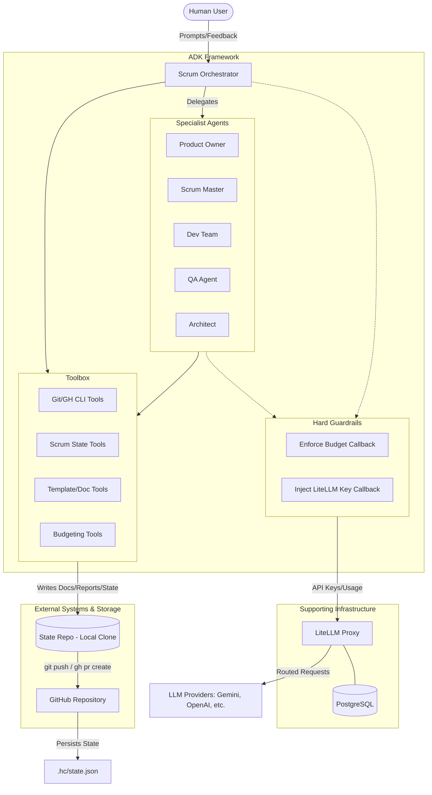

[← Back to README](../README.md)

# Architecture

## How it works (high level)

- A **root agent** (ScrumOrchestrator) receives your request and delegates to specialist sub-agents based on intent:
  - **Product Owner**: vision/goals, backlog items, acceptance criteria, prioritization
  - **Scrum Master**: facilitation, impediments, retros/actions
  - **Dev Team**: estimates, implementation plan, risks, test approach
  - **QA**: test strategy and quality signals
  - **Architect**: architectural risks and tradeoffs

- Agents maintain a shared in-session "source of truth" of Scrum artifacts (vision, goals, backlog, sprint goal, sprint backlog, DoD, impediments, retro actions, decision log).

The following diagram describes the interaction between the user, the ADK framework, the Scrum agents, and the supporting infrastructure (LiteLLM & GitHub).



## Design Principle: Enforce Mandatory Process Mechanically, Not Just by Prompting

A failure mode surfaced repeatedly across real eval runs: a rule stated only in an agent's prompt
("check the DoD before marking a story Done", "call `update_roadmap` once a story completes") was
reliably *not* followed by a cheap model under budget/token pressure, even when the prompt was
clear, mandatory, and repeated. Prompting alone is advisory - the model can skip it, misremember
it, or take a shortcut, and nothing catches that.

**The principle this project follows for any future mandatory process step: enforce it in the tool
layer itself, not only in the prompt that asks for it.** A tool call should either perform the
required step as an unavoidable side effect, or refuse to proceed when a mandatory precondition
isn't met - it should never be possible to "successfully" call a tool in a way that silently skips
a required step.

Concretely, in this codebase (see "Story workflow" below for the full feature these come from):
- **Automatic side effects instead of a second, separate step.** `advance_story_stage` updates
  `specs/ROADMAP.md`'s checkboxes as part of the same call that marks a stage complete - there's no
  separate "now remember to sync the roadmap" instruction left for the agent to forget.
- **Structural refusal instead of a checklist.** `_story_readiness_issues` refuses to write a story
  with an empty/placeholder title, user story, or acceptance criteria - it doesn't just ask the
  model to check `spec-templates/DOD.md`/`DOR.md` first. `check_build()` actually attempts to
  install the project's dependencies rather than asking QA to "verify the build works" by reading
  the code. `create_sprint_report` refuses to run at all unless a *new* retro action or impediment
  was logged since the last report. `deny_review` refuses an empty, placeholder, or generic
  ("not good", "denied") reason - a rejection isn't allowed to exist without saying what's wrong.
- **No bypass path left open.** Enforcing order/ownership in one tool (`advance_story_stage`) is
  only real enforcement if every other way to change the same state is closed off too -
  `upsert_story`/`upsert_epic`/`plan_sprint_backlog_item` refuse to set `status` directly to a
  pipeline stage name *or* a legacy done-synonym (`blocks_direct_status_set` in
  `agents/scrum_team/helpers.py`), so the enforced path can't be routed around through a
  less-guarded tool.
- **A tool's own success/failure must reflect the whole operation, not just the first part of it.**
  Several tools (`create_release_pr`, `upsert_backlog_item`, `plan_sprint_backlog_item`,
  `advance_story_stage`) call a second helper to finish their job (writing the story file, syncing
  the roadmap); each propagates that helper's failure into its own top-level `status` instead of
  unconditionally reporting "ok" once the first part succeeded - a caller that only checks the
  top-level status must be able to trust it.

When adding a new mandatory rule to this codebase, default to asking: can this be enforced in the
tool that performs the relevant action, rather than only stated in a prompt? If yes, do that first.
The prompt instruction is still worth keeping - it's what tells the agent to attempt the action in
the first place - but it must not be the only thing standing between "mandatory" and "optional".

## Repository documentation structure

This project separates documentation templates from the actual specification artifacts:

### 1. Specification Templates (`spec-templates/`)
Stored in this repository, these provide the structure for Scrum artifacts.

- `spec-templates/requirements/` — Product Requirements Document (PRD) and Software Requirements Specification (SRS) templates.
- `spec-templates/architecture/` — Architecture Decision Record (ADR) templates.
- `spec-templates/stories/` — User story templates.
- `spec-templates/workflows/` — Agentic workflow and runbook templates.
- `spec-templates/DOD.md` / `spec-templates/DOR.md` — Definition of Done / Definition of Ready
  checklists, mapped onto the 6-stage story pipeline below. Unlike the templates above, these
  aren't per-item blueprints to copy - every role reads them directly (`read_doc`).

### Story workflow (Draft → Ready → Implemented → Reviewed → Tested → Accepted)

Every story passes through exactly these 6 stages, in this exact order, no skipping:

| Stage | Owner | Gate |
|---|---|---|
| DRAFT | Product Owner (Architect supports on technical feasibility) | Story concept/mockup being shaped into a real backlog item - not yet fully specified (GH issue #94) |
| READY | Product Owner (Architect supports on technical feasibility) | Real title/user story/acceptance criteria, Dev Team estimate - see `spec-templates/DOR.md`. At the Stakeholder interaction level, also requires `record_design_approval` for this story (see below) |
| IMPLEMENTED | Dev Team | Real, working code committed and pushed |
| REVIEWED | Architect | Architectural/technical review complete |
| TESTED | QA | `check_build()` passes; test strategy verified |
| ACCEPTED | Product Owner | Acceptance criteria genuinely verified met - requires `record_acceptance_check` (see below) |

A stage is only ever completed via `advance_story_stage(title_or_id, stage)`
(`agents/scrum_team/tools/requirements.py`), which enforces this **in code**, not just by asking
nicely in a prompt:
- **No skipping**: rejects the call if the stages before it aren't done yet.
- **Stage ownership**: rejects the call if the calling agent isn't that stage's owner.
- **One story at a time**: `product_backlog` list order is priority order - a story can't advance
  past READY until the story immediately above it has reached ACCEPTED.
- **Content quality**: rejects marking READY (or the legacy "Done"/"Accepted") if the title/user
  story/acceptance criteria are missing or still placeholder text
  (`_story_readiness_issues` in `agents/scrum_team/tools/requirements.py`).
- **Design approval before Ready** (GH issue #94): at the Stakeholder interaction level, a story
  must have `record_design_approval(title_or_id, note)` called for it - a per-story flag, not a
  shared sprint-wide approval - before it can move from DRAFT to READY ("the designs are cleared by
  stakeholder review, then they are ready"). Not required at Product/CEO/EVAL - see
  `requires_pre_ready_design_approval` in `agents/scrum_team/helpers.py`.
- **Acceptance evidence before Accepted** (ISSUE-0043): `record_acceptance_check(title_or_id, note)`
  must have been called for this story - a per-story **counter**
  (`acceptance_check_count`), not a one-time flag, so a subsequent denial (see below) can require a
  genuinely fresh check rather than reuse of the one that got denied.
- **No bypass**: `upsert_story`/`upsert_epic`/`plan_sprint_backlog_item` refuse to set `status`
  directly to any of the 6 stage names - only `advance_story_stage` can.
- It also updates `specs/ROADMAP.md`'s per-stage checkboxes for that story automatically, in the
  same call - see below.

REVIEWED/TESTED/ACCEPTED are also the three stages someone can *deny*, not just complete -
`deny_review(title_or_id, stage, reason)` is the mechanical counterpart, restricted to that stage's
owner, that refuses an empty/placeholder/generic reason ("not good", "denied", ...) so a rejection
always says something Dev Team can act on. See RELEASE.md "Denying a review" for the full mechanics.

### 2. Specification Artifacts (`specs/`)
Stored in your **target state repository** (configured via `STATE_REPO_PATH` - see [State Repository](STATE-REPOSITORY.md)), these are the actual documents generated and updated by the agents.

- `specs/requirements/` — Active PRDs and SRS documents.
- `specs/architecture/` — Architecture Decision Records (ADRs).
- `specs/stories/` — Refined User Stories.
- `specs/workflows/` — Agentic workflows and runbooks.
- `specs/reports/` — Sprint review reports and budget status.
- `specs/ROADMAP.md` — Product roadmap tracking releases and stories. Each story gets its own 6
  checkboxes, one per stage of the story workflow above:
  ```
  - [US-0001] Create a to-do list
    - [x] DRAFT
    - [x] READY
    - [x] IMPLEMENTED
    - [ ] REVIEWED
    - [ ] TESTED
    - [ ] ACCEPTED
  ```
  These update automatically as a side effect of `advance_story_stage` - see "Story workflow" above
  - not via a separate manual roadmap-editing step. Status is resolved from whichever of
  `sprint_backlog` (Dev Team's working record) or `product_backlog` (PO's) has the more complete
  stage history for a given story, since the two aren't otherwise kept in sync with each other.

Contribution rules
- One artifact per file; keep them small and link related docs together
- Update docs in the same PR as the related code when possible
- Never commit real secrets — use placeholders, keep real values in your local `.env`
