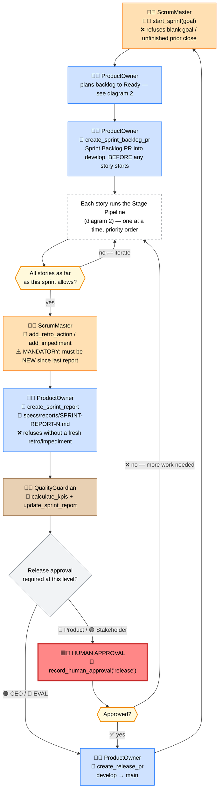
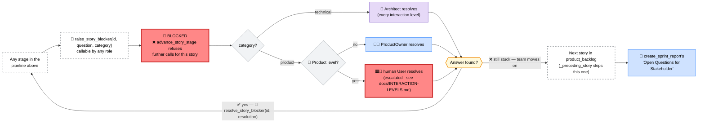

[← Back to README](../README.md)

# Development Workflow

A single, end-to-end reference for the process the Scrum team mechanically enforces - every stage,
gate, tool, and owning role, in one place. Deep-dive docs ([Architecture](ARCHITECTURE.md),
[Interaction Levels](INTERACTION-LEVELS.md), [RELEASE.md](../RELEASE.md) "Story workflow") remain the
source of truth for their slice; this page is the composite map plus the knobs that customize it.

## Agents and their tools

| Agent | Owns | Key tools |
|---|---|---|
| 🧑‍✈️ **ScrumOrchestrator** (root) | Routing only - never writes specs/code/commits itself | `init_scrum_state`, `create_litellm_virtual_key`, `configure_github_repo`/`configure_github_app`/`seed_repository`, `repo_status`, `save_state_to_repo`/`load_state_from_repo`, budget/read tools |
| 🧑‍💼 **ProductOwner** | Vision, backlog, priorities, acceptance | `upsert_prd`/`upsert_srs`, `update_roadmap`, `upsert_story`/`upsert_epic`/`upsert_issue`, `set_priority`/`plan_backlog_item`, `advance_story_stage`, `record_design_approval`, `record_acceptance_check`, `deny_review`, `raise_story_blocker`/`resolve_story_blocker`, `create_sprint_backlog_pr`, `create_release_pr`, `create_sprint_report`, `record_human_approval` |
| 🧑‍🏫 **ScrumMaster** | Facilitation, impediments, retros, budget housekeeping | `start_sprint`, `add_impediment`, `add_retro_action`, `record_human_approval`, `record_blocking_interaction`, `raise_story_blocker`, `update_budgets`/`get_budget_status` |
| 🧑‍💻 **DevTeam** | Implementation | `plan_sprint_backlog_item`, `advance_story_stage`, `raise_story_blocker`, `start_feature_branch`, `write_file`, `git_push`, `mark_pr_ready_for_review`, `gh_pr_*` |
| 👷 **Architect** | Technical review, ADRs | `advance_story_stage`, `deny_review`, `raise_story_blocker`/`resolve_story_blocker`, `gh_pr_review`/`gh_pr_comment`, `upsert_adr`, `write_file` |
| 🕵️ **QA** | Test strategy, build verification | `check_build`, `advance_story_stage`, `deny_review`, `raise_story_blocker`, `merge_story_pr`, `gh_pr_review`/`gh_pr_comment` |
| 🧑‍⚖️ **QualityGuardian** | KPI reporting | `calculate_kpis`, `update_sprint_report`, `upsert_issue` |

Every role uses an actual human-figure emoji - a deliberate, consistent "persona" icon per role. Mermaid
flowcharts have no native actor/stick-figure shape (that's a `sequenceDiagram`-only feature); a distinct
person emoji per box is the closest equivalent and doubles as a legend-free visual cue for "this is a
role," separate from the tool/state/gate icons below.

Each `LlmAgent`'s exact `tools=[...]` list (`agents/scrum_team/agent.py`) is the hard boundary - a
role literally cannot call a tool not listed there; ADK's dispatch rejects it (`on_tool_error_callback`
recovers gracefully instead of crashing - see RELEASE.md "Tool dispatch resilience").

Both flowcharts below share the same color key and icon vocabulary:

**Roles** (color + persona icon, leads every box): 🟦🧑‍💼 ProductOwner · 🟧🧑‍🏫 ScrumMaster ·
🟩🧑‍💻 DevTeam · 🟪👷 Architect · 🟨🕵️ QA · 🟫🧑‍⚖️ QualityGuardian ·
⬜ spans multiple roles (see the other diagram)

**Markers**: 🔧 tool call · 🔄 state change (sprint started / story stage advanced) ·
⚠️ mandatory condition · ❌ refused/errors if violated · 🟥👤 **human approval required** ·
◇ diamond = one-time routing decision (config-driven) · ⬡ hexagon = **iterative loop** - repeats
until the condition holds, not a single check. Human approval is one of these loops too, not a
one-way gate: a rejection is immediately actionable - it resubmits for revision and re-approval,
the same as a failed review, a failed build, or Product Owner acceptance sending a story back into
development.

**Interaction levels** (highlighted on every branch they affect - see section 3 for the full matrix):
🔵 Product · 🟣 Stakeholder · 🟠 CEO · 🤖 EVAL (fully autonomous, no human at all)

**🚫 BLOCKED**: not drawn as a branch off every single node below (it would make both diagrams
illegible) - any stage in diagram 2 can transition here instead, whenever the team genuinely can't
proceed, including a mechanical loop-detection trip. See "Blocked stories" after diagram 2.

**Artifacts**: 📄 marks a node that actually writes a persisted document/file (as opposed to just
state or a PR) - the exact path is named on the node itself.

## 1. Sprint lifecycle (the outer loop)

## 2. Story stage pipeline (per story, exactly 6 stages, no skipping)

```mermaid
flowchart TD
    subgraph ReqEng["📋 Requirements engineering & product workflow — happens while a story sits in DRAFT"]
        direction TB
        Vision["🧑‍💼 ProductOwner\n🔧 upsert_prd\n📄 specs/requirements/PRD-*.md\n🔄 parsed into product_vision/product_goals"]:::po
        Vision --> SRSDoc["🧑‍💼 ProductOwner\n🔧 upsert_srs (optional, technical detail)\n📄 specs/requirements/SRS-*.md"]:::po
        Vision --> Roadmap["🧑‍💼 ProductOwner\n🔧 update_roadmap\n📄 specs/ROADMAP.md"]:::po
        Roadmap --> Epic["🧑‍💼 ProductOwner\n🔧 upsert_epic\ngroups related stories"]:::po
        Epic --> StoryDraft["🧑‍💼 ProductOwner (+👷 Architect input)\n🔧 upsert_story\n📄 specs/stories/US-*.md"]:::po
        StoryDraft --> Prioritize["🧑‍💼 ProductOwner\n🔧 set_priority / plan_backlog_item"]:::po
    end
    Prioritize --> Draft["🧑‍💼 ProductOwner (+👷 Architect feasibility)\n🔄 DRAFT\n🔧 advance_story_stage\ntitle/user story/AC refined until real, not placeholder"]:::po
    Draft --> GateReady{"Stakeholder level?"}:::gate
    GateReady -- "🟣 Stakeholder" --> Design["🟥👤 HUMAN APPROVAL\n🔧 record_design_approval\nPO records the stakeholder's sign-off on this story's design"]:::human
    Design --> DesignGate{{"Design approved?"}}:::loop
    DesignGate -- "❌ no — revise & resubmit" --> Draft
    DesignGate -- "✅ yes" --> Ready
    GateReady -- "🔵 Product / 🟠 CEO / 🤖 EVAL" --> Ready["🧑‍💼 ProductOwner (+👷 Architect)\n🔄 READY\nreal title/story/AC + estimate"]:::po
    Ready --> GateImpl{"Approval required\nfor this level?"}:::gate
    GateImpl -- "🔵 Product / 🟣 Stakeholder: sprint" --> Approve1["🟥👤 HUMAN APPROVAL\n🔧 record_human_approval"]:::human
    GateImpl -- "🟠 CEO: budget" --> Approve1
    GateImpl -- "🤖 EVAL: none" --> Branch
    Approve1 --> ApproveGate{{"Approved?"}}:::loop
    ApproveGate -- "❌ no — revise & resubmit" --> Ready
    ApproveGate -- "✅ yes" --> Branch
    Branch["🧑‍💻 DevTeam\n🔧 start_feature_branch\nfeature/story-id-slug → develop, draft PR"]:::dev
    Branch --> Code["🧑‍💻 DevTeam\n🔧 write_file + git_push\n❌ refuses direct push to protected branches"]:::dev
    Code --> PRReady["🧑‍💻 DevTeam\n🔧 mark_pr_ready_for_review"]:::dev
    PRReady --> Impl["🧑‍💻 DevTeam\n🔄 IMPLEMENTED\n🔧 advance_story_stage"]:::dev
    Impl --> ArchReview["👷 Architect\n🔧 gh_pr_review / gh_pr_comment"]:::arch
    ArchReview --> ArchGate{{"Changes requested?"}}:::loop
    ArchGate -- "❌ yes — 🔧 deny_review(reason)\nback to development" --> Code
    ArchGate -- "✅ approved" --> Reviewed["👷 Architect\n🔄 REVIEWED\n🔧 advance_story_stage"]:::arch
    Reviewed --> Build["🕵️ QA\n🔧 check_build\nreal dependency install + test run"]:::qa
    Build --> BuildGate{{"Build/tests pass,\nno QA findings?"}}:::loop
    BuildGate -- "❌ no — 🔧 deny_review(reason)\nback to development" --> Code
    BuildGate -- "✅ yes" --> Tested["🕵️ QA\n🔄 TESTED\n🔧 advance_story_stage"]:::qa
    Tested --> Merge["🕵️ QA\n🔧 merge_story_pr\nfeature branch → develop"]:::qa
    Merge --> Verify["🧑‍💼 ProductOwner\n🔧 record_acceptance_check\nverifies acceptance criteria"]:::po
    Verify --> AcceptGate{{"Acceptance criteria\nactually met?"}}:::loop
    AcceptGate -- "❌ no — 🔧 deny_review(reason)\nback to development" --> Code
    AcceptGate -- "✅ yes" --> Accepted["🧑‍💼 ProductOwner\n🔄 ACCEPTED\n🔧 advance_story_stage"]:::po

    classDef po fill:#cfe2ff,stroke:#0d6efd,color:#000
    classDef sm fill:#ffe0b3,stroke:#fd7e14,color:#000
    classDef dev fill:#d1f7d6,stroke:#198754,color:#000
    classDef arch fill:#e6d9f7,stroke:#6f42c1,color:#000
    classDef qa fill:#fff3b0,stroke:#e0b400,color:#000
    classDef qg fill:#e8d0b3,stroke:#8b5a2b,color:#000
    classDef human fill:#ff8787,stroke:#c92a2a,stroke-width:3px,color:#000
    classDef gate fill:#f1f3f5,stroke:#868e96,color:#000
    classDef loop fill:#fff9db,stroke:#f08c00,stroke-width:2px,color:#000
```

`advance_story_stage` (`tools/requirements.py`) is the *only* tool that marks a stage complete, and
mechanically enforces order, ownership, one-story-at-a-time (can't pass Ready until the preceding
backlog item is Accepted), and content quality - never just prompt instructions. Every other tool that
could set `status` to a stage name directly (`upsert_story`/`upsert_epic`/`plan_sprint_backlog_item`)
refuses to (`blocks_direct_status_set`). Each successful call also re-renders `specs/ROADMAP.md`'s
checkboxes for that story in the same call - no separate step.

Its counterpart, `deny_review(title_or_id, stage, reason)`, is the *only* way to deny Reviewed/
Tested/Accepted mechanically instead of just never calling `advance_story_stage` (with the "why", if
stated at all, left in conversation text only). It refuses a `reason` that's empty, a template
placeholder, or a generic restatement of the verdict itself ("not good", "denied", ...) - a denial
must actually say what's wrong. The accepted reason is written onto the story's own record and
re-rendered into its Markdown file (Notes section), which Dev Team already reads via `read_doc` - so
a denial is mechanically visible and actionable, not something that only ever existed in a PR
comment or a conversation turn. Cleared automatically once the story advances past the stage it was
denied at.

Reviewed/Tested each require a fresh `gh_pr_review`/`gh_pr_comment` call from the deciding role since
the story's own denial (not just since the sprint-wide baseline) before they can complete again.
Accepted has its own evidence gate the same way: `record_acceptance_check(title_or_id, note)` must be
called - and, after a denial, called again - before `advance_story_stage(id, "Accepted")` succeeds;
this is a per-story counter, not a one-time flag, precisely so a denial can require a genuinely new
check instead of reuse of the one that got denied.

### Blocked stories (🚫 - any stage, any time)

Distinct from `deny_review` above: a denial is a clear, actionable verdict Dev Team can act on
directly. BLOCKED means nobody on the team currently has the answer - a real open question, or a
mechanical loop (the same `transfer_to_agent`/repeated-tool-call pattern the loop-breakers in
`agent.py` already refuse - they now raise this automatically once they've identified a stuck story,
so it can happen with no tool call at all on anyone's part).

- `raise_story_blocker(title_or_id, question, category)` - any role, once it recognizes the team is
  genuinely stuck. `category` is `"technical"` (Architect) or `"product"` (Product Owner - or the
  human User directly at the "Product" interaction level, since that human already IS the acting
  product owner day-to-day). Refuses a vague `question` the same way `deny_review` refuses a vague
  `reason`. Writes a `blocked` record onto the story (both backlog copies, re-rendered into its
  Markdown file) and raises a `blocking_interactions` entry (kind `"blocked_story"`).
- `advance_story_stage` refuses every further call for that story while `blocked` is set - resolved
  only by `resolve_story_blocker(title_or_id, resolution)`, callable only by the category's owning
  role. At the "Product" level, a `"product"`-category blocker mechanically refuses Product Owner's
  own resolution until the linked `blocking_interaction` has actually been resolved by the human
  first - the escalation has teeth, not just a notification Product Owner could route around.
- One-story-at-a-time ordering (`_preceding_story`) skips a BLOCKED predecessor automatically, so a
  stuck story doesn't also freeze every lower-priority one behind it - the team moves on to the next
  story instead of staying stuck.
- If it's never resolved this sprint, it isn't lost: `create_sprint_report` always includes an "Open
  Questions for Stakeholder" section listing every still-BLOCKED story, at every interaction level.

## 3. Interaction levels (who's in the loop, and how much)

`INTERACTION_LEVEL` (`.env`, four values) decides which of the two gate diamonds above actually
require a human, and how chatty the orchestrator is between them - full detail in
[INTERACTION-LEVELS.md](INTERACTION-LEVELS.md).

| Level | Ready gate | Implemented gate | Release gate | Report detail |
|---|---|---|---|---|
| 🔵 **Product** (default) | none | `sprint` approval | `release` approval | full |
| 🟣 **Stakeholder** | `record_design_approval` per story | `sprint` approval | `release` approval | business |
| 🟠 **CEO** | none | `budget` approval | none | executive |
| 🤖 **EVAL** | none | none | none | full |

## Customization points

| Want to change... | Edit | Effect |
|---|---|---|
| Who approves what, when | `.env`'s `INTERACTION_LEVEL` | Which gates in diagram 2 require a human (table above) |
| The stage list/ownership itself | `STORY_STAGES` / `STAGE_OWNERS` in `agents/scrum_team/helpers.py` | Add/remove/reorder stages, reassign which role owns one |
| Which branches are un-pushable | `_git_push_impl`'s `protected_branches` in `agents/scrum_team/tools/github.py` | What `git_push` refuses directly (default: `main`, `develop`) |
| A role's available tools | That `LlmAgent`'s `tools=[...]` in `agents/scrum_team/agent.py` | What a role can/can't call at all |
| How fast stuck loops get broken | `TRANSFER_LOOP_THRESHOLD` / `REPEATED_CALL_LOOP_THRESHOLD` in `agent.py` | Consecutive identical hand-offs/tool-calls tolerated before mechanical refusal |
| Sprint token/USD ceilings | `.env` budget vars - see [Budget Management](BUDGET.md) | When `check_cost_budget_callback` halts a sprint |
| Which model backs each role | `config/model-templates/*.yaml` (`setup_llm.py`) | Provider/model per agent alias |
| Report verbosity per level | `report_detail_level()` in `helpers.py` | What `create_sprint_report` renders (full/business/executive) |
| Who resolves a BLOCKED story's category | `BLOCKER_CATEGORY_OWNERS` / `should_escalate_blocker_to_user()` in `helpers.py` | Which role (or the human User) a `raise_story_blocker` category routes to |

## Verifying the tooling actually follows this state machine

`agents/scrum_team/tests/test_story_pipeline_state_machine.py` reads diagram 2 as a literal state
machine and drives one story through it by calling the real tool functions in the documented order -
no LLM, no ADK runner, just the same scripted Python calls a correctly-behaving conversation would
make. Covers the golden path (every review approved first try), all three review-fix loops
(Architect's code review, QA's, Product Owner's acceptance check - deny → fix → re-review → advance),
and the BLOCKED path above (raise → a lower-priority story proceeds anyway → resolve → advance).
Only genuine external boundaries (git/gh subprocess calls, the real pytest run) are mocked; every
gate/state mutation runs for real.

## Related docs

[Architecture](ARCHITECTURE.md) (system diagram, "enforce in code" principle) ·
[Interaction Levels](INTERACTION-LEVELS.md) (full gate/approval semantics) ·
[Budget Management](BUDGET.md) · [GitHub Integration](GITHUB-INTEGRATION.md) ·
[RELEASE.md](../RELEASE.md) "Story workflow"/"Branching model" (operational/GitFlow detail)
