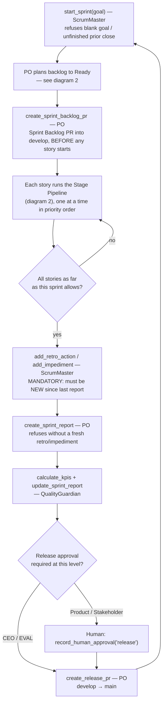
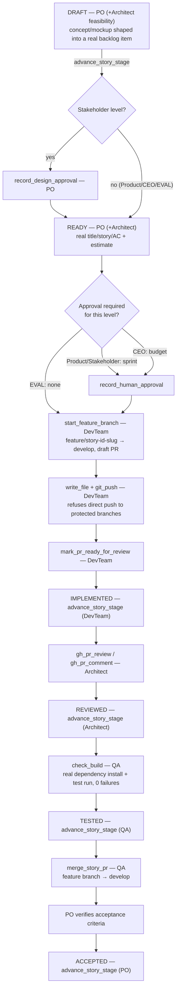

[← Back to README](../README.md)

# Development Workflow

A single, end-to-end reference for the process the Scrum team mechanically enforces - every stage,
gate, tool, and owning role, in one place. Deep-dive docs ([Architecture](ARCHITECTURE.md),
[Interaction Levels](INTERACTION-LEVELS.md), [RELEASE.md](../RELEASE.md) "Story workflow") remain the
source of truth for their slice; this page is the composite map plus the knobs that customize it.

## Agents and their tools

| Agent | Owns | Key tools |
|---|---|---|
| **ScrumOrchestrator** (root) | Routing only - never writes specs/code/commits itself | `init_scrum_state`, `create_litellm_virtual_key`, `configure_github_repo`/`configure_github_app`/`seed_repository`, `repo_status`, `save_state_to_repo`/`load_state_from_repo`, budget/read tools |
| **ProductOwner** | Vision, backlog, priorities, acceptance | `upsert_story`/`upsert_epic`/`upsert_issue`, `advance_story_stage`, `record_design_approval`, `create_sprint_backlog_pr`, `create_release_pr`, `create_sprint_report`, `record_human_approval` |
| **ScrumMaster** | Facilitation, impediments, retros, budget housekeeping | `start_sprint`, `add_impediment`, `add_retro_action`, `record_human_approval`, `record_blocking_interaction`, `update_budgets`/`get_budget_status` |
| **DevTeam** | Implementation | `plan_sprint_backlog_item`, `advance_story_stage`, `start_feature_branch`, `write_file`, `git_push`, `mark_pr_ready_for_review`, `gh_pr_*` |
| **Architect** | Technical review, ADRs | `advance_story_stage`, `gh_pr_review`/`gh_pr_comment`, `upsert_adr`, `write_file` |
| **QA** | Test strategy, build verification | `check_build`, `advance_story_stage`, `merge_story_pr`, `gh_pr_review`/`gh_pr_comment` |
| **QualityGuardian** | KPI reporting | `calculate_kpis`, `update_sprint_report`, `upsert_issue` |

Each `LlmAgent`'s exact `tools=[...]` list (`agents/scrum_team/agent.py`) is the hard boundary - a
role literally cannot call a tool not listed there; ADK's dispatch rejects it (`on_tool_error_callback`
recovers gracefully instead of crashing - see RELEASE.md "Tool dispatch resilience").

## 1. Sprint lifecycle (the outer loop)

## 2. Story stage pipeline (per story, exactly 6 stages, no skipping)

`advance_story_stage` (`tools/requirements.py`) is the *only* tool that marks a stage complete, and
mechanically enforces order, ownership, one-story-at-a-time (can't pass Ready until the preceding
backlog item is Accepted), and content quality - never just prompt instructions. Every other tool that
could set `status` to a stage name directly (`upsert_story`/`upsert_epic`/`plan_sprint_backlog_item`)
refuses to (`blocks_direct_status_set`). Each successful call also re-renders `specs/ROADMAP.md`'s
checkboxes for that story in the same call - no separate step.

## 3. Interaction levels (who's in the loop, and how much)

`INTERACTION_LEVEL` (`.env`, four values) decides which of the two gate diamonds above actually
require a human, and how chatty the orchestrator is between them - full detail in
[INTERACTION-LEVELS.md](INTERACTION-LEVELS.md).

| Level | Ready gate | Implemented gate | Release gate | Report detail |
|---|---|---|---|---|
| **Product** (default) | none | `sprint` approval | `release` approval | full |
| **Stakeholder** | `record_design_approval` per story | `sprint` approval | `release` approval | business |
| **CEO** | none | `budget` approval | none | executive |
| **EVAL** | none | none | none | full |

## Customization points

| Want to change... | Edit | Effect |
|---|---|---|
| Who approves what, when | `.env`'s `INTERACTION_LEVEL` | Which gates in diagram 2 require a human (table above) |
| The stage list/ownership itself | `STORY_STAGES` / `STAGE_OWNERS` in `agents/scrum_team/helpers.py` | Add/remove/reorder stages, reassign which role owns one |
| Which branches are un-pushable | `_git_push_impl`'s `protected_branches` in `agents/scrum_team/tools/github.py` | What `git_push` refuses directly (default: `main`, `develop`) |
| A role's available tools | That `LlmAgent`'s `tools=[...]` in `agents/scrum_team/agent.py` | What a role can/can't call at all |
| How fast stuck loops get broken | `TRANSFER_LOOP_THRESHOLD` / `REPEATED_CALL_LOOP_THRESHOLD` in `agent.py` | Consecutive identical hand-offs/tool-calls tolerated before mechanical refusal |
| Sprint token/USD ceilings | `.env` budget vars - see [Budget Management](BUDGET.md) | When `check_cost_budget_callback` halts a sprint |
| Which model backs each role | `config/model-templates/*.yaml` (`setup_llm.py`) | Provider/model per agent alias |
| Report verbosity per level | `report_detail_level()` in `helpers.py` | What `create_sprint_report` renders (full/business/executive) |

## Related docs

[Architecture](ARCHITECTURE.md) (system diagram, "enforce in code" principle) ·
[Interaction Levels](INTERACTION-LEVELS.md) (full gate/approval semantics) ·
[Budget Management](BUDGET.md) · [GitHub Integration](GITHUB-INTEGRATION.md) ·
[RELEASE.md](../RELEASE.md) "Story workflow"/"Branching model" (operational/GitFlow detail)
